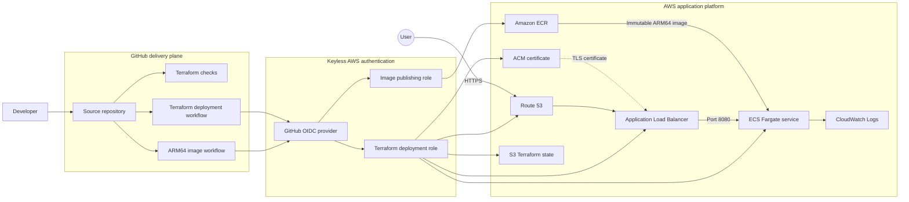

# Threat Composer AWS Platform

[](https://github.com/Raihan11x/threat-composer-aws-platform/actions/workflows/terraform-checks.yml)
[](https://github.com/Raihan11x/threat-composer-aws-platform/actions/workflows/image-publish.yml)
[](https://github.com/Raihan11x/threat-composer-aws-platform/tree/main/terraform/bootstrap)
[](https://github.com/Raihan11x/threat-composer-aws-platform/tree/main/terraform)
[](https://github.com/Raihan11x/threat-composer-aws-platform/tree/main/terraform/modules/ecs)

A production-grade AWS delivery platform for running the open-source AWS Threat Composer application on Amazon ECS Fargate.

The platform uses modular Terraform, ARM64 containers, keyless GitHub Actions authentication, immutable releases, managed TLS, remote state locking, and guarded infrastructure deployments.

> **Deployment status:** Infrastructure and delivery pipelines are implemented. Public deployment is waiting for domain activation and DNS delegation before the first complete Terraform deployment.

## Engineering outcomes

- Reduced the container build-and-publish step from **21 minutes 36 seconds to 3 minutes 13 seconds**, an improvement of approximately **85%**
- Removed long-lived AWS credentials from CI/CD by using **GitHub OIDC and short-lived AWS role sessions**
- Separated Terraform deployment and container publishing into independently permissioned IAM roles
- Created traceable releases using immutable Git commit SHA image tags
- Added guarded `PLAN`, `CONFIRM`, and `DESTROY` deployment operations
- Implemented encrypted, versioned S3 remote state with native state locking
- Designed a cost-conscious ARM64 Fargate runtime without a NAT gateway
- Split the AWS infrastructure into reusable Terraform modules

## Architecture



## Request flow

When deployment is complete, traffic will follow this path:

```text
https://app.raihanali.co.uk
        |
        v
Amazon Route 53
        |
        v
Application Load Balancer
        |
        | TLS termination with ACM
        v
ECS Fargate service
        |
        v
ARM64 Threat Composer container
```

HTTP requests on port 80 are permanently redirected to HTTPS on port 443. The load balancer forwards traffic to the application on port 8080.

## Platform components

| Component | Purpose |
|---|---|
| Amazon ECR | Stores immutable application images |
| Amazon ECS Fargate | Runs the container without managing EC2 instances |
| Application Load Balancer | Provides health checks and public HTTP/HTTPS entry |
| AWS Certificate Manager | Issues and validates the TLS certificate |
| Amazon Route 53 | Hosts DNS records for the application |
| Amazon CloudWatch Logs | Collects application container logs |
| Amazon S3 | Stores encrypted and versioned Terraform state |
| GitHub Actions | Validates Terraform, publishes images, and deploys infrastructure |
| GitHub OIDC | Provides short-lived AWS authentication without access keys |

## CI/CD workflows

### Terraform checks

The Terraform validation workflow runs for pull requests and pushes affecting infrastructure code.

It performs:

- Terraform formatting checks
- Backend-free Terraform initialisation
- Terraform configuration validation

This workflow has no AWS permissions and cannot deploy infrastructure.

### Application image publishing

The image workflow runs from `main` when application or image-workflow files change. It can also be started manually.

It:

1. Authenticates to AWS through GitHub OIDC
2. Verifies that the ECR repository exists
3. Builds the application for `linux/arm64`
4. Reuses GitHub Actions BuildKit cache
5. Tags the image with the Git commit SHA
6. Publishes the immutable image to Amazon ECR

### Terraform deployment

Infrastructure deployment is manually controlled through GitHub Actions.

Supported operations are:

| Operation | Required confirmation |
|---|---|
| Plan | `PLAN` |
| Apply | `CONFIRM` |
| Destroy | `DESTROY` |

The workflow validates the requested operation, branch, image tag, AWS role, domain, and remote-state configuration before running Terraform.

Apply and destroy operations use the saved plan created within the same workflow job.

## Container design

The application uses a multi-stage Docker build:

1. A Node.js build stage installs locked dependencies and compiles the static application.
2. An unprivileged NGINX runtime serves only the compiled assets on port 8080.

```dockerfile
FROM --platform=$BUILDPLATFORM node:22.23.2-bookworm-slim AS build

# Build application

FROM nginxinc/nginx-unprivileged:1.30.4-alpine3.24 AS runtime

# Serve compiled assets
```

The final runtime image excludes Node.js, source code, and build dependencies.

Additional build controls include:

- Frozen Yarn lockfile
- Non-interactive dependency installation
- Disabled production source maps
- ARM64 target architecture
- BuildKit layer caching
- Unprivileged runtime user

## Security controls

### Keyless AWS authentication

GitHub Actions exchanges its OIDC token for short-lived AWS credentials. No permanent AWS access keys are stored in GitHub.

The trust policy is restricted by:

- GitHub OIDC audience
- Immutable repository owner ID
- Immutable repository ID
- The `main` branch subject

### Separated IAM responsibilities

Two GitHub Actions roles are used:

- **Terraform deployment role:** manages the defined AWS infrastructure
- **Image publishing role:** can authenticate to ECR and publish images only to the application repository

The Terraform role restricts `iam:PassRole` to project roles passed specifically to ECS tasks.

### Network boundaries

- The Application Load Balancer accepts public HTTP and HTTPS traffic
- HTTP is redirected to HTTPS
- ECS tasks accept application traffic only from the load balancer security group
- Invalid HTTP header fields are dropped by the load balancer
- The tasks use public IPs to avoid NAT Gateway cost, but direct inbound access is blocked by security-group rules

### Artifact controls

- ECR image tags are immutable
- Images use Git commit SHA tags rather than `latest`
- ECR basic scanning is enabled on image push
- Terraform validates image tags before deployment

## Reliability controls

The Terraform configuration defines:

- ECS deployment circuit-breaker rollback
- Load-balancer health checks
- ECS steady-state deployment waiting
- CloudWatch log retention
- ECS Container Insights
- Multi-AZ public networking
- S3 state versioning
- Native S3 state locking
- GitHub Actions concurrency controls

## Cost-conscious decisions

This implementation deliberately balances production patterns with portfolio and development cost:

- ARM64 Fargate runtime
- 0.25 vCPU and 512 MiB default task size
- One running task by default
- Public task networking without a NAT Gateway
- S3-managed encryption instead of a customer-managed KMS key
- GitHub Actions build caching

These choices reduce ongoing cost but introduce documented trade-offs. A higher-availability production deployment would normally use multiple tasks across private subnets.

## Terraform modules

```text
terraform/
├── backend.tf
├── main.tf
├── outputs.tf
├── variables.tf
├── bootstrap/
│   ├── github-actions-policy.tf
│   ├── github-image-push.tf
│   ├── github-oidc.tf
│   └── main.tf
└── modules/
    ├── acm/
    ├── alb/
    ├── dns-alias/
    ├── ecr/
    ├── ecs/
    ├── iam/
    ├── network/
    └── route53-zone/
```

Each module owns one infrastructure responsibility and exposes only the values required by other components.

## Repository structure

```text
.
├── .github/
│   └── workflows/
│       ├── image-publish.yml
│       ├── terraform-checks.yml
│       └── terraform-deploy.yml
├── app/
│   ├── Dockerfile
│   ├── package.json
│   ├── public/
│   └── src/
├── terraform/
│   ├── bootstrap/
│   ├── modules/
│   ├── backend.tf
│   ├── main.tf
│   ├── outputs.tf
│   └── variables.tf
└── README.md
```

## Run the application locally

Build the ARM64 container:

```bash
docker build \
  --platform linux/arm64 \
  -t threat-composer:local \
  ./app
```

Run it:

```bash
docker run \
  --rm \
  -p 8080:8080 \
  threat-composer:local
```

Open [http://localhost:8080](http://localhost:8080).

## Infrastructure workflow

The state bucket and GitHub OIDC roles are created separately through the bootstrap Terraform configuration. This solves the dependency problem where the deployment pipeline cannot authenticate until its AWS role exists.

The main infrastructure is then managed through the manual Terraform deployment workflow:

1. Publish an immutable application image
2. Copy its Git commit SHA
3. Run the Terraform workflow with the `plan` operation and `PLAN`
4. Review the plan
5. Run it again with the `apply` operation and `CONFIRM`
6. Verify ECS health, HTTPS, DNS, and application availability

Infrastructure destruction requires the separate `destroy` operation and exact `DESTROY` confirmation.

## Current operational status

| Capability | Status |
|---|---|
| Multi-stage application container | Verified |
| ARM64 image publishing pipeline | Verified |
| Amazon ECR repository | Deployed |
| GitHub OIDC authentication | Deployed and verified |
| Separated GitHub IAM roles | Deployed |
| S3 remote state and native locking | Deployed and verified |
| Modular Terraform infrastructure | Implemented and validated |
| Route 53 hosted zone | Deployed |
| Registrar nameserver delegation | Waiting for domain activation |
| ACM certificate validation | Pending DNS delegation |
| ECS, ALB, and public HTTPS deployment | Pending first full apply |

## Further production hardening

The next production improvements would include:

- Running at least two ECS tasks across availability zones
- Moving ECS tasks into private subnets
- Adding VPC endpoints or controlled NAT egress
- Configuring ECS service autoscaling
- Adding CloudWatch alarms and operational dashboards
- Enabling ALB access logs
- Adding AWS WAF protections
- Gating image publication on application tests and vulnerability severity
- Pinning GitHub Actions and container images by immutable digest
- Adding synthetic HTTPS availability monitoring

## Application source

This platform deploys the open-source [AWS Threat Composer](https://github.com/awslabs/threat-composer) application as its workload.

Threat Composer helps teams create, document, and manage threat models. The upstream application retains its original copyright and licence notices.

## Evidence

- [Original container workflow](https://github.com/Raihan11x/threat-composer-aws-platform/actions/runs/34739579656)
- [Optimised successful container workflow](https://github.com/Raihan11x/threat-composer-aws-platform/actions/runs/34746233903)
- [Repository workflows](https://github.com/Raihan11x/threat-composer-aws-platform/actions)